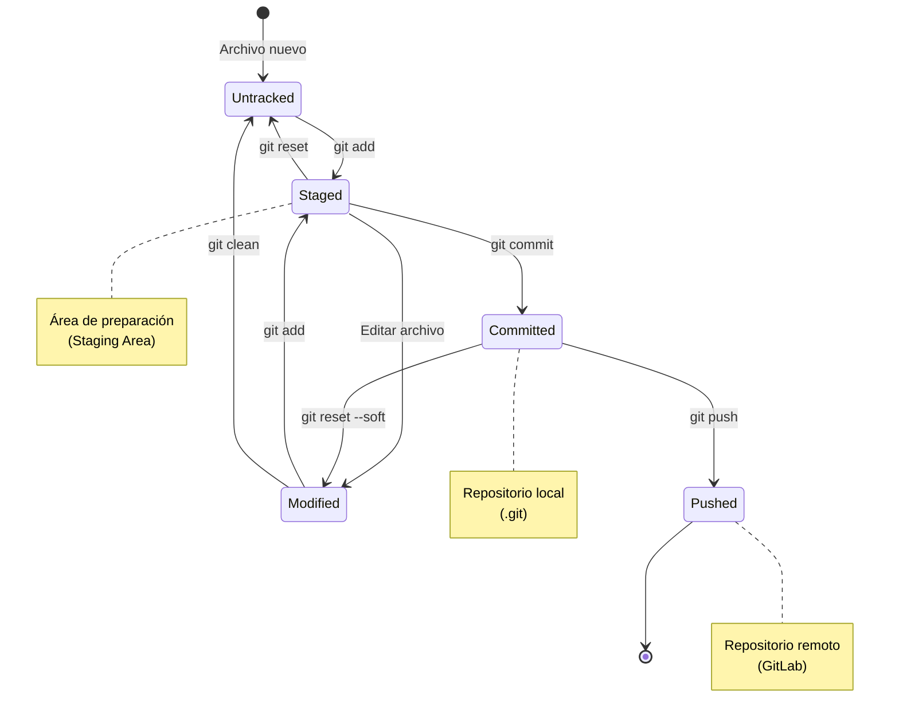

```mermaid
stateDiagram-v2
    [*] --> Untracked: Archivo nuevo
    Untracked --> Staged: git add
    
    Modified --> Staged: git add
    Staged --> Committed: git commit
    
    Committed --> Pushed: git push
    Pushed --> [*]
    
    Staged --> Modified: Editar archivo
    Committed --> Modified: git reset --soft
    
    Modified --> Untracked: git clean
    Staged --> Untracked: git reset
    
    note right of Staged
        Área de preparación
        (Staging Area)
    end note
    
    note right of Committed
        Repositorio local
        (.git)
    end note
    
    note right of Pushed
        Repositorio remoto
        (GitLab)
    end note
```
